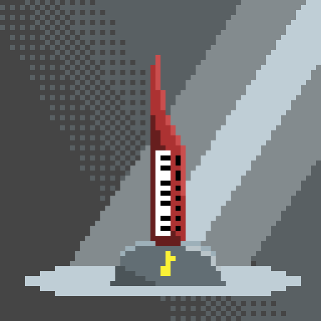

I'm learning how to make pixel art. The hope is that I'll have a body of work to look back on at the end of the year.

Here's the non-tutorial pixel art I've made so far:

## #pixeldailies "keyboard" theme

